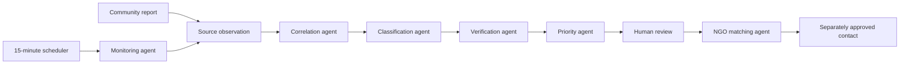

# Agent Platform Architecture

The platform handles incidents in Bangladesh. It helps human operators review
information and prepare a response. It does not command rescue teams or replace
emergency services.



## The agent jobs

- **Monitoring** reads an enabled public source.
- **Correlation** links similar observations to one incident.
- **Classification** suggests the incident type and structured facts.
- **Verification** measures whether evidence supports the incident.
- **Priority** calculates urgency using fixed rules.
- **NGO matching** suggests up to three reviewed organizations.

The queue stores jobs in PostgreSQL. Jobs have leases, retries, idempotency
keys, and a dead state. Agent runs store small summaries for operators.

Communication, reporting, and wider voice automation are extension points. They
are not active agents in this release.

## Human control

- An agent cannot approve facts.
- New facts or evidence cancel an old approval.
- Matching is advice only. It cannot contact an organization.
- Live contact needs approved facts, reviewed contact data, and a pilot district.
- National emergency services such as 999 are manual-only.
- Voice calls also need organization consent and a second operator action.
- Call results contain bounded status data, not transcripts.

These switches are `false` unless a builder changes them:

```env
MONITORING_ENABLED=false
LIVE_OUTREACH_ENABLED=false
VOICE_ENABLED=false
```

## Sources

The seed includes disabled entries for community reports, ReliefWeb, Bangladesh
Flood Forecasting and Warning Centre, and USGS earthquakes. A builder must
review each source's rules and configuration before enabling it.

Broad social-media crawling is not included.

## Running the queue

A scheduler may call `GET /internal/cron/monitor` about every 15 minutes. The
request must include `Authorization: Bearer <CRON_SECRET>`.

When monitoring is disabled, this endpoint can still process jobs created by
community reports. It does not poll external sources.

## Adding an agent

1. Add its name to the controlled agent-name list.
2. Define a small, strict job input.
3. Write a handler that returns a safe summary.
4. Register the handler with the orchestrator.
5. Add tests for success, retries, stale data, and forbidden actions.

Keep agents small. Reuse deterministic domain rules. Never place secrets, raw
reports, contact details, or provider transcripts in job summaries.
