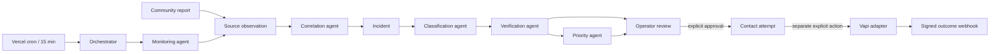

# AI Agent Platform Architecture

The MVP is a Bangladesh-only incident monitoring and coordination platform. It
supports nationwide incident data while live response actions remain limited to
the configured pilot districts (initially Chattogram and Cox's Bazar).

## Foundation

- `monitoring_sources` contains curated connectors and per-source health state.
  All seeded external sources are disabled until an operator configures and
  enables them.
- `source_observations` is the provenance and deduplication boundary. Raw
  community content is restricted; operator lists expose normalized metadata.
- `workflow_jobs` is a durable Postgres queue with leases, retries, dead-letter
  state, and idempotency keys. `agent_runs` records each bounded agent action.
- Incidents retain human review state alongside agent verification and priority.
- `contact_attempts` records operator authorization separately from provider
  execution and provider outcomes.

## Implemented agents

- Monitoring: polls a configured connector and normalizes observations.
- Correlation: links an observation only when there is one unambiguous candidate;
  otherwise it creates a new incident for review.
- Classification: uses the provider-neutral model gateway, with a conservative
  deterministic fallback when no model is configured.
- Verification: converts source provenance to evidence and applies the existing
  evidence gate. It never grants operator approval.
- Priority: applies deterministic risk scoring and P0-P3 labels.

Communication, NGO matching, reporting, and voice are represented by stable
contracts. Matching and outreach logic from the earlier phases remains usable;
the next versions can move those services behind agent handlers without changing
the queue or incident model.

## Safety invariants

- Agent output cannot set `factsApproved` or `operator_approved`.
- Fact edits, evidence changes, and newly correlated observations revoke stale
  approval before agents recalculate the incident.
- Live contact requires approved facts, `operator_approved` verification, a
  reviewed organization, and a configured pilot district.
- Tier 1 national emergency services (including 999) are manual-only.
- Voice additionally requires organization opt-in, a reviewed phone number, an
  explicit approved attempt, a single database execution claim, a second
  operator action, and both live feature flags.
- Monitoring, outreach, and voice flags default to false.
- Provider webhooks store bounded outcome metadata, not call transcripts.

## Activation runbook

1. Apply the committed migration to a non-production database and run the seed.
2. Set `CRON_SECRET` and `RELIEFWEB_APP_NAME`; enable only sources whose terms and
   credentials have been reviewed. USGS requires no application credential.
3. Set `MONITORING_ENABLED=true` in a preview environment and observe source
   health and agent runs through the operator API.
4. Keep `LIVE_OUTREACH_ENABLED=false` and `VOICE_ENABLED=false` during shadow
   operation. Review false positives, correlation behavior, and retry/dead jobs.
5. Populate real organizations only from reviewed public contact information,
   including escalation tier and automation consent.
6. For the pilot, configure Vapi and its webhook secret, then enable live flags
   only after call scripts and escalation procedures are approved.

FFWC remains a configuration-required connector because its official data access
must be registered and validated before use. Broad social-media crawling is out
of scope for this MVP.

The cron worker continues processing queued community reports when external
monitoring is disabled. The flag controls external polling, not user-report
intake.
