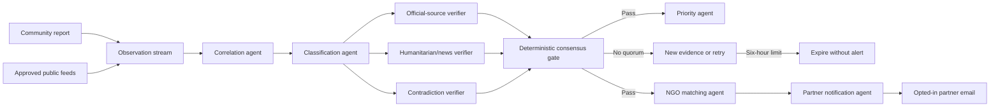

# Autonomous Agent Platform Architecture

The platform is a 24/7 disaster-intelligence and NGO-coordination layer for Bangladesh. It does not dispatch police, fire, or ambulances and never calls 999.

## Strict consensus

A revision passes only when every verifier role has reported, at least two verifier outputs support it, evidence spans at least two independent domains and source families, confidence is 80 or higher, core facts are present, and no credible contradiction exists. A contradiction vetoes escalation. Every job carries the incident revision so stale results cannot act on newer facts.

## Autonomous partner notification

Only corroborated revisions may be matched. Candidates must be reviewed, have a contact email, and explicitly allow automation. Email is gated by both `AUTONOMOUS_ESCALATION_ENABLED` and `PARTNER_EMAIL_ENABLED`. Provider requests and database records use idempotency keys; signed Resend webhooks record delivered, delayed, bounced, or failed outcomes.

The observer console exposes read operations only. It cannot edit facts, add evidence, change state, generate matches, or send notifications.

## 999 boundary and value

[Bangladesh Police 999](https://telecom-police.portal.gov.bd/pages/static-pages/695e3b0cc4774958d7b72321) is the 24/7 toll-free government call service for immediate police, fire, and ambulance support. This platform instead addresses fragmented information, cross-source verification, longitudinal situational awareness, NGO discovery, and structured humanitarian alerts. Responders and communities use both: 999 for immediate dispatch; this platform for coordinated, evidence-linked humanitarian response.

## Sources and operations

Connectors support community reports, ReliefWeb, USGS, registered FFWC JSON endpoints, and approved RSS/Atom feeds. Sources are disabled until configured and approved. Broad social-media crawling is not included.

The PostgreSQL queue provides leases, bounded retries, idempotency, dead-job handling, and safe agent summaries. A scheduler calls `GET /internal/cron/monitor` with `Authorization: Bearer <CRON_SECRET>`.

When adding an agent, define a strict input, deterministic safety checks, a bounded output summary, stale-revision behavior, and tests for success, contradiction, retry, duplicate delivery, and forbidden action. Never put secrets, raw reports, or recipient addresses in agent summaries.
