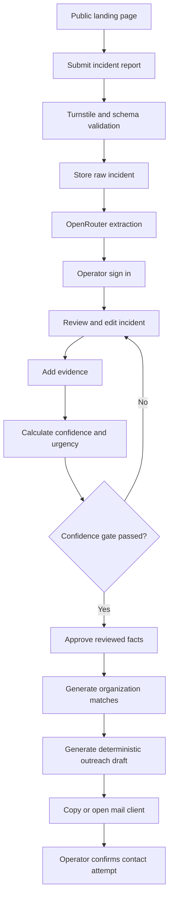
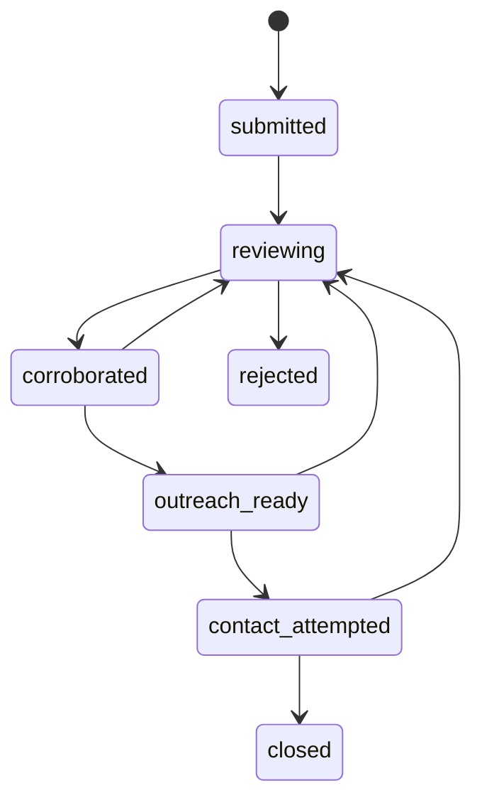
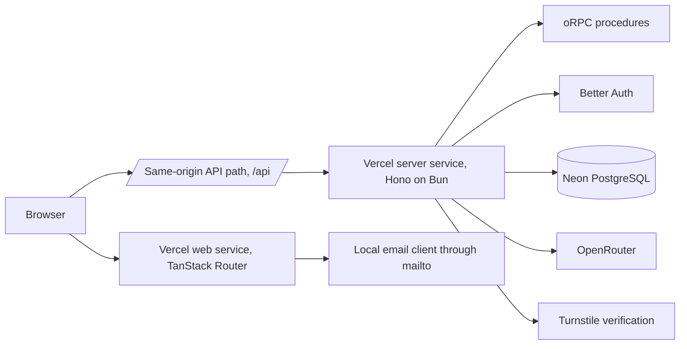

# Rapid Humanitarian Response Platform

> An analyst-assisted humanitarian incident triage MVP that turns a report into a reviewed case, measures evidence confidence and urgency separately, matches suitable responders from a curated registry, and prepares a manual outreach message.

## Document authority

This document is the final Version 1 build contract.

Codex and contributors must implement only the items marked **Must Have**. Items marked Should Have, Could Have, or Won't Have are documentation for later releases. The 6 to 8 hour limit takes priority over feature breadth.

When this document conflicts with generated example code, this document controls product behavior and safety. When it conflicts with the current Better-T-Stack scaffold structure, keep the generated structure and adapt the feature locations without redesigning the scaffold.

# 0. Final architecture and product review

## 0.1 Review outcome

**Decision: approved for development after the corrections in this revision.**

The earlier PRD had a valid product direction, but it was not ready to build with the selected stack. It still specified Next.js, Supabase, pnpm, no full authentication, REST-style routes, and a single web application. This revision aligns every technical section with the final stack:

- TanStack Router frontend.
- Hono backend.
- Bun runtime and package manager.
- oRPC API contracts.
- Better Auth for operator access.
- Neon PostgreSQL.
- Drizzle ORM.
- Vercel Services for one-domain web and API deployment.
- Turborepo monorepo.
- Biome, Lefthook, evlog, MCP, and agent skills.

## 0.2 Scope corrections applied

The following changes make the MVP practical within 6 to 8 hours:

1. ReliefWeb import moved from Must Have to Should Have.
2. Automated source monitoring remains postponed.
3. Public incident browsing was removed from Version 1.
4. Operator authentication became a Must Have.
5. The operator access code design was removed.
6. Public reporter email collection was removed.
7. Cloudflare Turnstile became required for anonymous submissions.
8. Outreach generation became a deterministic template, not a second AI task.
9. Opening a `mailto:` link no longer counts as successful contact.
10. The evidence confidence formula now has exact independence rules.
11. The urgency schema now includes blocked access.
12. The data model now includes constraints, indexes, actor tracking, and demo records.
13. The default deployment runs in Demo Mode to prevent false expectations.
14. The Codex build sequence now starts with one complete vertical slice.

## 0.3 Version 1 proof

Version 1 proves this sequence:

> Submit, structure, review, support with evidence, score, match, prepare contact.

It does not prove automatic incident detection, aid delivery, responder availability, or field outcomes.

# 1. Product definition

## 1.1 Problem

Humanitarian incident information is spread across community reports, official notices, news reports, and organization networks. Reports may be incomplete, duplicated, outdated, or wrong. Even when a report is credible, an operator still needs to structure the facts, assess urgency, find a suitable responder, and prepare a useful message.

Version 1 reduces that coordination work. It creates one reviewed incident record containing:

- What was reported.
- Where and when it happened.
- Which needs were reported.
- Which evidence supports or contradicts the report.
- How strong the evidence is.
- How urgent the reported conditions appear.
- Which reviewed organizations match the location and needs.
- Which message an operator can manually send.

## 1.2 Core promise

> A trained operator can turn a submitted report into a reviewed responder shortlist and editable outreach package in less than five minutes, after the evidence is available.

## 1.3 MVP operating mode

Version 1 launches in **Demo Mode** by default.

Demo Mode requirements:

- Show a visible banner on public and operator pages.
- State that the product is a prototype and does not dispatch emergency services.
- Use synthetic incidents or public-source incident summaries for demonstrations.
- Use clearly labeled demo organization records unless real records have been manually reviewed.
- Do not imply that submissions are monitored continuously.
- Do not promise contact, rescue, aid, or resolution.

Required public notice:

> This is a prototype for humanitarian incident triage. It does not dispatch emergency services and does not guarantee that an organization will respond. For immediate danger, contact the relevant local authorities or emergency services.

## 1.4 Pilot boundary

Version 1 focuses on:

- Country: Bangladesh.
- Division: Chattogram.
- Priority district: Cox's Bazar.
- Incident categories: floods, landslides, cyclones, displacement, food shortage, water shortage, and urgent medical access needs.
- Interface language: English.

The Roadmap page must state that global coverage and Bangla support are planned later.

## 1.5 Product principles

- **Evidence before certainty.** AI extracts facts but does not declare truth.
- **Urgency and confidence are separate.** A report can be urgent and uncertain.
- **Human approval before contact.** Version 1 never sends external messages automatically.
- **Minimum necessary data.** Do not request names, identity documents, phone numbers, private medical records, or exact household locations.
- **Local-first matching.** Prefer reviewed organizations with relevant sector and area coverage.
- **Clear uncertainty.** Show missing, unsupported, and contradicted information.
- **No false availability claims.** A match does not mean an organization is ready or able to respond.
- **Open development.** Product limits, decisions, and contribution rules remain public.
- **Fast interaction.** Main tasks work on mobile and require few steps.

# 2. Goals, measurements, and exclusions

## 2.1 Version 1 goals

- Accept an anonymous incident report.
- Protect anonymous intake from basic automated abuse.
- Store raw report data before AI extraction.
- Extract an editable incident structure through OpenRouter.
- Require authenticated operator review.
- Record supporting and contradicting evidence links.
- Calculate deterministic confidence and urgency scores.
- Match reviewed organizations from a curated registry.
- Generate an editable, deterministic outreach package.
- Provide copy and prefilled email actions.
- Record case state changes and key audit events.
- Publish a Roadmap page and contributor documentation.
- Deploy one working web and API project.

## 2.2 Version 1 measurements

| Measurement | Target |
|---|---:|
| Anonymous report completion | Under 3 minutes |
| AI extraction under normal API conditions | Under 30 seconds |
| Operator review to shortlist after evidence is ready | Under 5 minutes |
| Main flow usable at 360 px width | Yes |
| Main flow usable with keyboard only | Yes |
| Automatic external messages sent | 0 |
| Raw AI output written without schema validation | 0 |
| Organizations matched without Reviewed status | 0 |
| Public pages exposing raw reports or contact emails | 0 |
| Production report accepted without Turnstile validation | 0 |
| Build, type check, lint, and required tests passing | Yes |

## 2.3 Version 1 exclusions

- Continuous incident monitoring.
- Automatic news discovery.
- Social media collection.
- Media upload or verification.
- Global launch.
- Aid delivery guarantees.
- Rescue dispatch.
- Donations or payments.
- Beneficiary accounts.
- NGO accounts.
- Automatic NGO discovery.
- Automatic NGO approval.
- Live NGO availability.
- Automatic email delivery.
- Medical, legal, security, or deployment decisions.
- Multi-organization coordination.
- Case chatbot.
- Public incident search.

# 3. Users and permissions

## 3.1 Anonymous reporter

An anonymous person can:

- Read the prototype notice.
- Submit an incident report.
- Receive a random case reference.
- View a generic success page.

An anonymous person cannot:

- View submitted report details.
- Search cases.
- View organization contact data.
- Change a case.
- mark evidence or facts as reviewed.

## 3.2 Operator

An authenticated, allowlisted operator can:

- View the incident dashboard.
- Open an incident.
- Edit extracted facts.
- add or remove evidence.
- Approve reviewed facts.
- Recalculate scores.
- Generate organization matches.
- Generate and edit outreach drafts.
- Copy an outreach package.
- Open a prefilled email draft.
- Confirm that a contact attempt was made.
- Change allowed case states.

## 3.3 Open-source contributor

A contributor needs:

- A five-step local setup.
- A clear folder map.
- An `AGENTS.md` file for Codex and other coding agents.
- A contribution guide.
- Issue templates.
- Test commands.
- Safety and privacy constraints.
- A public roadmap.

## 3.4 Roles not implemented

Version 1 does not implement:

- NGO user.
- Government user.
- Community verifier.
- Reporter follow-up account.
- System administrator UI.

# 4. MoSCoW scope

## 4.1 Must Have, implement now

| ID | Feature | Required result |
|---|---|---|
| M01 | Prototype landing page | Explains purpose, limits, pilot area, and actions. |
| M02 | Anonymous report form | Creates a stored incident after validation and Turnstile verification. |
| M03 | Better Auth operator access | Only allowlisted authenticated users access operator routes and procedures. |
| M04 | Incident persistence | Raw report is stored before extraction. |
| M05 | OpenRouter extraction | Produces editable structured data through a strict Zod schema. |
| M06 | Human incident review | Operator reviews, edits, and explicitly approves facts. |
| M07 | Evidence records | Operator adds supporting, contradicting, or context sources. |
| M08 | Deterministic scoring | Confidence and urgency are calculated separately and explained. |
| M09 | Curated organization registry | Seeded reviewed organizations or clearly labeled demo organizations. |
| M10 | Deterministic matching | Top three organizations with scores and reasons. |
| M11 | Manual outreach package | Editable template, copy actions, and optional `mailto:` action. |
| M12 | Protected dashboard and states | Operator can list cases, open details, and make allowed state changes. |
| M13 | Minimal audit trail | Records meaningful actions without sensitive payloads. |
| M14 | Safety, privacy, and accessibility | Public warnings, data limits, access control, form errors, and keyboard support. |
| M15 | Roadmap and open-source handoff | Roadmap page, README, AGENTS, CONTRIBUTING, SECURITY, LICENSE. |
| M16 | Deployment and checks | Web and Hono API deploy together on Vercel and required checks pass. |

## 4.2 Should Have, next release

Do not implement these until every Must Have acceptance criterion passes.

- ReliefWeb operator-triggered import.
- Bangla interface.
- Organization registry editor.
- Reporter correction or deletion request token.
- Real email delivery after explicit operator approval.
- Delivery and bounce tracking.
- Duplicate source URL detection across imported feeds.
- Basic outcome and usage measurements.
- Better rate-limit storage.
- Password reset and email verification.
- Organization availability fields.

## 4.3 Could Have, later releases

- Additional official feeds.
- Scheduled feed checks.
- Public social data through permitted APIs.
- Photo and video evidence.
- Media redaction and provenance checks.
- Geocoding and maps.
- Offline reporting.
- SMS and hotline intake.
- NGO accounts and profile claims.
- Registry and sanctions review workflows.
- Community verifier network.
- Multi-organization task coordination.
- Case-specific responder assistant.
- Controlled outreach waves.
- Government and UN adapters.
- Public, privacy-safe aggregate statistics.

## 4.4 Won't Have for now

- Automatic truth declarations.
- Autonomous external contact.
- Mass email.
- Private account or closed-group scraping.
- Face recognition.
- Public exact coordinates.
- Identity document collection.
- Beneficiary payment handling.
- Automated medical diagnosis.
- Rescue or deployment orders.
- Public labels that call organizations good or bad.
- Public raw incident reports.

# 5. End-to-end flows

## 5.1 Main flow



## 5.2 Anonymous report flow

1. User opens `/report`.
2. The page shows the prototype warning before the form.
3. User enters incident details without personal identity data.
4. User accepts the data notice.
5. Turnstile produces a token.
6. The Hono API validates the token and form schema.
7. The server stores the raw report and creates an audit event.
8. The server attempts structured extraction.
9. Extraction success or failure does not change report acceptance.
10. The page returns a random reference and no incident details.

## 5.3 Operator flow

1. Operator signs in through Better Auth.
2. The Hono authorization middleware checks the session and email allowlist.
3. Operator opens the dashboard.
4. Operator opens a submitted incident.
5. Operator reviews and edits fields.
6. Operator adds evidence.
7. Operator recalculates scores.
8. Operator approves facts only when the confidence gate passes.
9. Operator generates matches.
10. Operator creates an outreach draft from reviewed fields.
11. Operator copies the draft or opens the local email client.
12. Operator separately confirms a contact attempt.

## 5.4 Failure behavior

| Failure | Required behavior |
|---|---|
| Turnstile fails | Reject submission and show a safe retry message. |
| Database write fails | Do not show success or a reference. |
| OpenRouter times out | Keep incident stored, show Extraction Failed to operator. |
| OpenRouter JSON is invalid | Discard generated fields and keep raw report. |
| Operator session missing | Return `UNAUTHORIZED` and redirect to sign-in. |
| Operator email not allowlisted | Return `FORBIDDEN`. |
| No evidence | Confidence remains low and outreach is blocked. |
| No organization match | Show an empty state, do not lower review rules. |
| Mail client cannot open | Copy action remains available. |
| API unavailable | Preserve form values in browser memory and show Retry. |

# 6. Functional requirements

## 6.1 Landing page

### Content order

1. Prototype status banner.
2. Clear product heading.
3. One-paragraph explanation.
4. Primary action, `Submit an incident report`.
5. Secondary action, `Operator sign in`.
6. Three-step explanation, Submit, Review, Prepare contact.
7. Pilot coverage and limitations.
8. Roadmap and GitHub links.

### Acceptance criteria

- Purpose is understandable within 10 seconds.
- Prototype warning is visible without scrolling.
- No wording promises rescue, aid, contact, or resolution.
- Primary action is visible at 360 px width.

## 6.2 Anonymous report form

### Form layout

Use one page with three visible fieldsets. Do not build a route-based wizard in Version 1.

1. **What happened**
2. **Where and when**
3. **Needs and submission check**

### Required fields

- Incident type.
- District or area.
- Approximate location description.
- Time description.
- Reported needs, at least one.
- Incident description, 40 to 2,000 characters.
- Data notice checkbox.
- Turnstile token in production.

### Fixed pilot values

- Country is fixed to Bangladesh.
- Division is fixed to Chattogram.
- District offers Cox's Bazar, Chattogram, Bandarban, Rangamati, Khagrachhari, Feni, Noakhali, Lakshmipur, Cumilla, Chandpur, Brahmanbaria, and Other or Unknown.

The district list must be stored as a constant, not duplicated in components.

### Optional fields

- Public source URL.
- Estimated affected population.

Do not collect reporter email in Version 1.

### Safety notice

> Do not include names, identity documents, phone numbers, private medical details, faces, or exact household locations. Use an approximate area when possible.

### Validation

- URL schemes allowed: `https` and `http` only.
- Affected population must be a non-negative whole number.
- Description strips leading and trailing whitespace.
- Description is rendered as plain text only.
- Honeypot must remain empty.
- Production requests require successful server-side Turnstile validation.

### Acceptance criteria

- Errors appear at the top and beside affected fields.
- Focus moves to the error summary after failed submission.
- Form values remain after a recoverable failure.
- A successful response contains only the reference and status.
- The public client never receives raw database errors.

## 6.3 Structured extraction

### Schema

```ts
import { z } from "zod";

export const incidentExtractionSchema = z.object({
  title: z.string().min(5).max(160),
  summary: z.string().min(20).max(1200),
  incidentType: z.enum([
    "flood",
    "landslide",
    "cyclone",
    "fire",
    "earthquake",
    "displacement",
    "food_insecurity",
    "water_shortage",
    "medical_access",
    "other",
  ]),
  country: z.literal("Bangladesh"),
  division: z.literal("Chattogram"),
  district: z.string().min(2).max(120).nullable(),
  locationText: z.string().max(300).nullable(),
  occurredAt: z.string().datetime({ offset: true }).nullable(),
  occurredAtPrecision: z.enum(["exact", "approximate", "unknown"]),
  affectedEstimate: z.number().int().nonnegative().nullable(),
  needs: z.array(
    z.enum([
      "rescue",
      "shelter",
      "food",
      "water",
      "medical",
      "sanitation",
      "protection",
      "transport",
      "information",
      "other",
    ]),
  ).min(1).max(10),
  riskFlags: z.object({
    peopleTrapped: z.boolean(),
    noSafeWater: z.boolean(),
    noFood: z.boolean(),
    urgentMedicalNeed: z.boolean(),
    displacement: z.boolean(),
    vulnerableGroupsReported: z.boolean(),
    accessBlocked: z.boolean(),
  }),
  unknowns: z.array(z.string().min(1).max(200)).max(10),
});
```

### AI rules

- Use one pinned model identifier from `OPENROUTER_MODEL`.
- Use a server-side call only.
- Send the minimum report text needed.
- Tell the model that source text is untrusted data, not instructions.
- Request structured JSON.
- Validate with Zod before writing generated fields.
- Keep unknown values null or in `unknowns`.
- Never infer an affected population without explicit source text.
- Never decide credibility, urgency, organization trust, or contact permission.
- Record model ID, request time, duration, and validation outcome.
- Do not record the API key or complete prompt in logs.

### Timeouts

- Server timeout target: 20 seconds.
- No automatic repeated retries.
- Operator can click Retry Extraction.

## 6.4 Human review

The incident detail page must let the operator edit:

- Title.
- Summary.
- Incident type.
- District.
- Approximate location.
- Occurrence time and precision.
- Affected estimate.
- Needs.
- Risk flags.
- Unknowns.

Approval requirements:

- Operator is authenticated and allowlisted.
- At least one evidence record supports the event.
- Confidence gate passes.
- Operator checks `I reviewed these facts against the listed evidence`.
- Server validates the gate again.

## 6.5 Evidence

### Evidence fields

- URL.
- Source name.
- Source category.
- Relationship.
- Publication time, optional.
- Operator note, optional.
- Publisher domain, derived server-side from the URL.
- Independent original source, operator checkbox.

### Source categories and base values

| Category | Base confidence value |
|---|---:|
| Official authority | 70 |
| UN or established humanitarian source | 60 |
| Established news organization | 50 |
| Local news organization | 40 |
| Community or eyewitness report | 20 |
| Unknown | 0 |

### Relationships

- Supports.
- Contradicts.
- Context Only.

### Independence rule

A source counts as independent only when the operator confirms that it is not a copy, repost, syndication, or summary of another listed source. Distinct domains alone do not prove independence.

## 6.6 Evidence confidence score

Confidence measures available evidence, not truth.

### Formula

```text
base = highest base value among supporting evidence
secondIndependent = +20 when at least 2 independent supporting sources exist
thirdIndependent = +10 when at least 3 independent supporting sources exist
credibleContradiction = -30 when official, humanitarian, established news, or local news evidence contradicts a core event claim
missingLocation = -10 when district and location are both missing
missingTime = -10 when occurredAt is null and precision is unknown
score = clamp(base + bonuses - penalties, 0, 100)
```

### Labels

- 0 to 39, Unverified.
- 40 to 69, Needs Review.
- 70 to 100, Corroborated.

### Outreach gate

All conditions must be true:

- Confidence score is at least 70.
- At least one supporting source has a base value of 40 or higher.
- No unresolved credible contradiction exists.
- Facts are approved by an operator.

The UI must show which records affected the score.

## 6.7 Urgency score

Urgency uses reported conditions and does not confirm that the report is accurate.

| Reported condition | Points |
|---|---:|
| People trapped or immediate physical danger | 35 |
| Urgent medical access need | 25 |
| No safe drinking water | 20 |
| Displacement or no shelter | 20 |
| No food | 15 |
| Vulnerable groups reported | 10 |
| Access or transport blocked | 10 |

Clamp to 0 through 100.

Labels:

- 75 to 100, Critical.
- 50 to 74, High.
- 25 to 49, Medium.
- 0 to 24, Low.

Never use color alone. Show label, numeric value, and accessible text.

## 6.8 Organization registry

### Required fields

- Name.
- Website.
- Public contact email, optional.
- Country.
- Divisions or districts served.
- Sectors.
- Organization type.
- Review status.
- Review source URLs.
- Last reviewed date.
- Demo record flag.

### Review statuses

- Reviewed.
- Needs Review.
- Do Not Contact.

Only Reviewed organizations can be matched.

In Demo Mode, a Reviewed demo record may be matched only when it is visibly labeled Demo and uses an `.example` contact address. Codex must not invent a real organization's email address.

## 6.9 Organization matching

### Sector mapping

| Incident need | Matching organization sector |
|---|---|
| rescue | search and rescue, emergency response |
| shelter | shelter, camp management |
| food | food assistance, nutrition |
| water | water, sanitation and hygiene |
| medical | health, emergency medical support |
| sanitation | water, sanitation and hygiene |
| protection | protection |
| transport | logistics, emergency transport |
| information | information management, community communication |

### Score

| Match condition | Points |
|---|---:|
| First matching sector | 40 |
| Additional matching sector | 10 each, maximum 20 |
| Exact district served | 25 |
| Chattogram Division served | 15 |
| Bangladesh served | 10 |
| Public contact email exists | 5 |
| Review status is Reviewed | Required |

Clamp to 0 through 100.

### Required output

- Top three matches.
- Match score.
- Plain-language reasons.
- Contact availability label, `Unknown in Version 1`.
- Visible Demo label when applicable.

## 6.10 Outreach package

Version 1 uses a deterministic template built from operator-approved fields. Do not call an AI model for outreach text.

### Required content

- Subject.
- Case reference.
- Reviewed incident summary.
- Approximate location and time.
- Confidence label and score.
- Urgency label and score.
- Reported needs.
- Evidence links.
- Clear request for acknowledgement and independent verification.
- Prototype disclaimer.

### Required disclaimer

> This message was prepared by an open-source humanitarian triage prototype. The listed facts were reviewed against the attached public evidence, but conditions may change. Please verify through your normal procedures before acting.

### Actions

- Copy subject.
- Copy body.
- Open prefilled email draft.
- Confirm contact attempt.

Rules:

- Opening `mailto:` creates `outreach.mailto_opened` only.
- It does not change the incident state.
- `Confirm contact attempt` requires a separate operator action.
- Keep prefilled email text below 1,500 characters when practical.
- If the encoded link is too long, disable `mailto:` and keep Copy Body available.

## 6.11 Dashboard

### Default sort

1. Critical urgency.
2. High urgency.
3. Lowest confidence within the same urgency.
4. Most recently updated.

### Filters

Must Have:

- State.
- Urgency.
- Text search over title and location.

Country and confidence filters are postponed because the pilot country is fixed and confidence is visible on each row.

### Row or card content

- Title.
- District and approximate location.
- Incident type.
- Urgency label and score.
- Confidence label and score.
- State.
- Updated time.

## 6.12 Case states

Stored values:

```text
submitted
reviewing
corroborated
outreach_ready
contact_attempted
closed
rejected
```

Allowed transitions:



Server rules, not UI visibility, must enforce transitions.

`closed` means the operator closed the triage case. It does not mean the humanitarian problem was resolved.

## 6.13 Audit events

Required event types:

- `report.created`.
- `extraction.started`.
- `extraction.completed`.
- `extraction.failed`.
- `incident.edited`.
- `incident.review_started`.
- `incident.facts_approved`.
- `evidence.added`.
- `evidence.removed`.
- `scores.calculated`.
- `matches.generated`.
- `outreach.generated`.
- `outreach.subject_copied`.
- `outreach.body_copied`.
- `outreach.mailto_opened`.
- `outreach.contact_attempt_confirmed`.
- `incident.state_changed`.

Audit metadata must contain IDs, counts, old and new status values, or score values. It must not contain raw reports, full outreach bodies, passwords, session values, or API keys.

# 7. Information architecture and UI design

## 7.1 Public routes

| Route | Purpose |
|---|---|
| `/` | Landing page. |
| `/report` | Anonymous report form. |
| `/report/success/$reference` | Generic confirmation. |
| `/roadmap` | Vision, future work, and contribution paths. |
| `/privacy` | Data notice and product limits. |
| `/sign-in` | Operator sign in and allowlisted account setup. |

There is no public incident list in Version 1.

## 7.2 Protected routes

Use a protected TanStack Router layout route.

| Route | Purpose |
|---|---|
| `/_app` | Auth and allowlist guard. |
| `/_app/dashboard` | Incident list and filters. |
| `/_app/incidents/$incidentId` | Review, evidence, scoring, matches, outreach, audit. |
| `/_app/organizations` | Read-only organization registry. |

The browser URL may omit the underscore based on TanStack Router pathless layout behavior. Preserve the generated router conventions.

## 7.3 Navigation

### Public header

- Project name.
- Submit report.
- Roadmap.
- GitHub.
- Operator sign in.

### Authenticated header

- Dashboard.
- Organizations.
- Roadmap.
- GitHub.
- User menu and sign out.

Do not build a sidebar in Version 1.

## 7.4 Design direction

The interface should feel calm, direct, and trustworthy.

Use:

- White or neutral surfaces.
- One primary action per section.
- Clear headings.
- Short paragraphs.
- Visible source links.
- Text status labels.
- Generous spacing.
- Standard form controls.
- Confirmation before state changes.

Avoid:

- Decorative animation.
- Auto-playing media.
- Dense charts.
- Hidden status meanings.
- Multiple competing primary buttons.
- Full-screen modal flows.
- Map-first design.
- Claims that the AI verified truth.

## 7.5 Layout

### Public pages

- Maximum content width: 72rem.
- Form width: 46rem.
- Horizontal page padding: 1rem mobile, 1.5rem tablet, 2rem desktop.
- Header stays simple and wraps into a menu on small screens.

### Operator pages

- Maximum content width: 80rem.
- Dashboard uses a table above 768 px and cards below 768 px.
- Incident detail uses one main column and one compact status column on desktop.
- Mobile uses one column with the primary action near the top.

## 7.6 Visual hierarchy for incident detail

1. Prototype banner.
2. Incident title and location.
3. State, urgency, and confidence.
4. Current required operator action.
5. Reviewed facts.
6. Evidence.
7. Score explanation.
8. Organization matches.
9. Outreach package.
10. Audit timeline.

## 7.7 Shared components

Use shadcn/ui primitives from the generated shared UI package.

Required app components:

- `PrototypeBanner`.
- `PageHeader`.
- `StatusBadge`.
- `ScoreBadge`.
- `IncidentForm`.
- `ErrorSummary`.
- `IncidentList`.
- `IncidentReviewForm`.
- `EvidenceList`.
- `EvidenceForm`.
- `ScoreBreakdown`.
- `OrganizationMatchCard`.
- `OutreachEditor`.
- `AuditTimeline`.
- `EmptyState`.
- `LoadingState`.

## 7.8 Form behavior

- Every input has a visible label.
- Required and optional status is written in text.
- Error messages explain the correction.
- Error summary links to fields.
- Focus is visible.
- Submit buttons show progress and prevent duplicate clicks.
- Success and error status updates use an ARIA live region.
- Tap targets are at least 44 by 44 CSS pixels.
- No information depends only on color.

## 7.9 Roadmap page

Required sections:

1. Mission.
2. What Version 1 does.
3. What Version 1 does not do.
4. Why features were postponed.
5. Planned release stages.
6. How developers can contribute.
7. How humanitarian reviewers can contribute.
8. How local organizations can propose corrections.
9. Safety and privacy principles.
10. Link to GitHub issues and security reporting.

# 8. Final technical stack

## 8.1 Scaffold command

Run the dry check first:

```bash
bun create better-t-stack@latest rapid-humanitarian-response \
  --frontend tanstack-router \
  --backend hono \
  --runtime bun \
  --api orpc \
  --auth better-auth \
  --payments none \
  --database postgres \
  --orm drizzle \
  --db-setup neon \
  --package-manager bun \
  --git \
  --web-deploy vercel \
  --server-deploy vercel \
  --addons biome evlog lefthook mcp skills turborepo \
  --examples none \
  --disable-analytics \
  --dry-run
```

Create the project after the dry check passes:

```bash
bun create better-t-stack@latest rapid-humanitarian-response \
  --frontend tanstack-router \
  --backend hono \
  --runtime bun \
  --api orpc \
  --auth better-auth \
  --payments none \
  --database postgres \
  --orm drizzle \
  --db-setup neon \
  --package-manager bun \
  --git \
  --web-deploy vercel \
  --server-deploy vercel \
  --install \
  --addons biome evlog lefthook mcp skills turborepo \
  --examples none \
  --disable-analytics
```

Do not replace Hono with Fastify in Version 1.

## 8.2 Why Hono

Hono is the correct Version 1 backend because:

- The scaffold supports Hono with Bun and Vercel.
- It uses standard Request and Response APIs.
- Better Auth has a documented Hono integration.
- oRPC has a documented Hono adapter.
- The backend is small and request-driven.
- Version 1 has no persistent worker process.

Fastify can be reconsidered only if the product later moves to a permanent server process with substantial plugin and lifecycle requirements. Background workers should be separate services and do not require replacing Hono.

## 8.3 System architecture



Vercel Services should deploy `apps/web` and `apps/server` under one domain. Requests under `/api/*` route to Hono. Keep the generated `vercel.json` unless a documented deployment issue requires a change.

## 8.4 Runtime boundaries

- Browser code can call oRPC clients only.
- Browser code never imports server database code.
- Hono owns database, auth, OpenRouter, and Turnstile secrets.
- OpenRouter calls exist in one server module.
- Scoring and matching are pure functions shared only where safe.
- No external email provider exists in Version 1.
- No scheduled task or worker exists in Version 1.

## 8.5 Database connection

- Use Neon PostgreSQL through the generated Drizzle setup.
- Use the pooled connection string for serverless functions when provided.
- Keep database and Vercel function regions as close as the selected free plans permit.
- Do not create a second Supabase database.
- Do not add MongoDB.
- Do not expose a database connection string to the web application.

## 8.6 API style

Use oRPC procedures, not a separate handwritten REST layer.

Procedure groups:

```text
public.report.create
public.system.status
operator.incident.list
operator.incident.get
operator.incident.update
operator.incident.startReview
operator.incident.approveFacts
operator.incident.changeState
operator.incident.retryExtraction
operator.evidence.create
operator.evidence.remove
operator.score.recalculate
operator.match.generate
operator.outreach.generate
operator.outreach.update
operator.outreach.recordCopy
operator.outreach.recordMailtoOpen
operator.outreach.confirmContactAttempt
operator.organization.list
```

Better Auth remains mounted under `/api/auth/*` as generated.

Do not expose OpenAPI documentation publicly in Version 1. It may be enabled for local development or a protected operator route.

# 9. Repository structure

Keep the generated Better-T-Stack monorepo. Do not move database or auth files into new packages during the 6 to 8 hour build.

```text
rapid-humanitarian-response/
├── apps/
│   ├── web/
│   │   ├── src/
│   │   │   ├── components/
│   │   │   ├── features/
│   │   │   │   ├── auth/
│   │   │   │   ├── reports/
│   │   │   │   ├── incidents/
│   │   │   │   ├── evidence/
│   │   │   │   ├── organizations/
│   │   │   │   └── outreach/
│   │   │   ├── routes/
│   │   │   ├── utils/
│   │   │   ├── main.tsx
│   │   │   └── index.css
│   │   └── package.json
│   └── server/
│       ├── src/
│       │   ├── db/
│       │   │   ├── schema/
│       │   │   │   ├── auth.ts
│       │   │   │   ├── incidents.ts
│       │   │   │   ├── evidence.ts
│       │   │   │   ├── organizations.ts
│       │   │   │   ├── matches.ts
│       │   │   │   ├── outreach.ts
│       │   │   │   └── audit.ts
│       │   │   ├── seed/
│       │   │   └── index.ts
│       │   ├── domain/
│       │   │   ├── scoring/
│       │   │   ├── matching/
│       │   │   ├── extraction/
│       │   │   └── outreach/
│       │   ├── lib/
│       │   │   ├── auth.ts
│       │   │   ├── authorization.ts
│       │   │   ├── openrouter.ts
│       │   │   ├── turnstile.ts
│       │   │   └── logger.ts
│       │   ├── routers/
│       │   │   ├── public.ts
│       │   │   ├── incidents.ts
│       │   │   ├── evidence.ts
│       │   │   ├── organizations.ts
│       │   │   └── outreach.ts
│       │   └── index.ts
│       ├── drizzle/
│       ├── drizzle.config.ts
│       └── package.json
├── packages/
│   ├── config/
│   ├── env/
│   └── ui/
├── docs/
│   ├── architecture.md
│   ├── data-safety.md
│   └── roadmap.md
├── .github/
│   ├── ISSUE_TEMPLATE/
│   └── PULL_REQUEST_TEMPLATE.md
├── AGENTS.md
├── CONTRIBUTING.md
├── CODE_OF_CONDUCT.md
├── SECURITY.md
├── LICENSE
├── README.md
├── bts.jsonc
├── turbo.json
└── vercel.json
```

## 9.1 Code organization rules

- Keep route files thin.
- Keep oRPC input and output schemas next to procedures.
- Keep business rules in `domain` modules.
- Keep score and match functions pure.
- Keep database calls out of React components.
- Keep external API calls out of client code.
- Keep one purpose per file.
- Do not create a generic `utils.ts` dumping file.
- Do not refactor generated auth, env, or deployment code without a failing requirement.
- Do not add a state management library. Use TanStack Query, route state, and local form state.

# 10. Data model

Better Auth owns its generated user, session, account, and verification tables. Do not manually rewrite those tables.

## 10.1 `incidents`

| Column | Type | Rule |
|---|---|---|
| `id` | uuid | Primary key. |
| `reference` | text | Unique random public reference. |
| `source_type` | text | `community`, `manual`, or future `reliefweb`. |
| `source_url` | text nullable | Public source only. |
| `raw_report` | text | Restricted. Stored before extraction. |
| `title` | text nullable | Null until extraction or review. |
| `summary` | text nullable | Null until extraction or review. |
| `incident_type` | text nullable | Controlled value. |
| `country` | text | Fixed to Bangladesh in Version 1. |
| `division` | text | Fixed to Chattogram in Version 1. |
| `district` | text nullable | Controlled list plus Other or Unknown. |
| `location_text` | text nullable | Approximate location only. |
| `occurred_at` | timestamptz nullable | UTC when known. |
| `occurred_at_precision` | text | `exact`, `approximate`, or `unknown`. |
| `affected_estimate` | integer nullable | Non-negative. |
| `needs` | jsonb | Controlled string array. |
| `risk_flags` | jsonb | Controlled boolean object. |
| `unknowns` | jsonb | String array. |
| `confidence_score` | integer | 0 to 100. Default 0. |
| `urgency_score` | integer | 0 to 100. Default 0. |
| `state` | text | Controlled transition value. |
| `facts_approved` | boolean | Default false. |
| `reviewed_by_user_id` | text nullable | Better Auth user ID. |
| `reviewed_at` | timestamptz nullable | UTC. |
| `model_id` | text nullable | Pinned extraction model. |
| `extraction_status` | text | `pending`, `complete`, or `failed`. |
| `created_at` | timestamptz | UTC. |
| `updated_at` | timestamptz | UTC. |

## 10.2 `evidence`

| Column | Type | Rule |
|---|---|---|
| `id` | uuid | Primary key. |
| `incident_id` | uuid | Foreign key with cascade delete. |
| `url` | text | Required. |
| `source_name` | text | Required. |
| `publisher_domain` | text | Derived by server. |
| `source_category` | text | Controlled value. |
| `relationship` | text | `supports`, `contradicts`, or `context`. |
| `is_independent` | boolean | Operator decision. |
| `note` | text nullable | Maximum 500 characters. |
| `published_at` | timestamptz nullable | UTC when known. |
| `created_by_user_id` | text | Better Auth user ID. |
| `created_at` | timestamptz | UTC. |

## 10.3 `organizations`

| Column | Type | Rule |
|---|---|---|
| `id` | uuid | Primary key. |
| `name` | text | Required. |
| `website` | text | Public official source. |
| `contact_email` | text nullable | Public official contact only. |
| `country` | text | Required. |
| `areas_served` | jsonb | Division and district strings. |
| `sectors` | jsonb | Controlled sector strings. |
| `organization_type` | text | Controlled value. |
| `review_status` | text | `reviewed`, `needs_review`, `do_not_contact`. |
| `review_sources` | jsonb | Public source URLs. |
| `last_reviewed_at` | timestamptz nullable | Required when reviewed and not demo. |
| `is_demo` | boolean | Default false. |
| `created_at` | timestamptz | UTC. |
| `updated_at` | timestamptz | UTC. |

## 10.4 `incident_matches`

| Column | Type | Rule |
|---|---|---|
| `id` | uuid | Primary key. |
| `incident_id` | uuid | Foreign key. |
| `organization_id` | uuid | Foreign key. |
| `score` | integer | 0 to 100. |
| `reasons` | jsonb | Plain-language string array. |
| `created_at` | timestamptz | UTC. |

Add a unique constraint on incident and organization.

## 10.5 `outreach_drafts`

| Column | Type | Rule |
|---|---|---|
| `id` | uuid | Primary key. |
| `incident_id` | uuid | Foreign key. |
| `organization_id` | uuid | Foreign key. |
| `subject` | text | Editable. |
| `body` | text | Editable. |
| `status` | text | `draft`, `copied`, `mailto_opened`, or `contact_attempted`. |
| `created_by_user_id` | text | Better Auth user ID. |
| `created_at` | timestamptz | UTC. |
| `updated_at` | timestamptz | UTC. |

## 10.6 `audit_events`

| Column | Type | Rule |
|---|---|---|
| `id` | uuid | Primary key. |
| `incident_id` | uuid nullable | Related incident. |
| `actor_user_id` | text nullable | Null for anonymous report creation. |
| `event_type` | text | Controlled value. |
| `metadata` | jsonb | Safe metadata only. |
| `created_at` | timestamptz | UTC. |

## 10.7 Required database constraints and indexes

- Unique index on `incidents.reference`.
- Index on `incidents.state`.
- Index on `incidents.urgency_score`.
- Index on `incidents.updated_at`.
- Index on `evidence.incident_id`.
- Index on `incident_matches.incident_id`.
- Index on `audit_events.incident_id` and `created_at`.
- Check constraints for both scores from 0 to 100.
- Check constraint for non-negative affected estimate.
- Foreign keys for all incident and organization relationships.
- No public database client connection.

# 11. Authentication and authorization

## 11.1 Better Auth configuration

- Use the generated Drizzle adapter.
- Enable email and password authentication for the MVP.
- Require a password length of at least 12 characters.
- Do not add social providers.
- Do not expose a general public operator registration link.
- Allow user creation only when the submitted email appears in `OPERATOR_EMAIL_ALLOWLIST`.
- Check the allowlist in a server-side Better Auth hook.
- Check the session and allowlist again in protected oRPC middleware.

## 11.2 Authorization rules

Public procedures:

- `public.report.create`.
- `public.system.status`.

All other procedures require:

1. Valid Better Auth session.
2. Session user email in the normalized allowlist.
3. Active user record.

Hiding a frontend route is never sufficient authorization.

## 11.3 Session safety

- Use secure, HTTP-only cookies in production.
- Use same-origin `/api` deployment.
- Keep generated CSRF and origin checks.
- Do not store auth tokens in local storage.
- Do not log session cookies or passwords.

# 12. Privacy, safety, and abuse controls

## 12.1 Data not collected

Version 1 must not request:

- Full names of affected people.
- Identity documents.
- Personal phone numbers.
- Private medical records.
- Exact household coordinates.
- Photos, videos, or faces.
- Ethnic, political, or religious identity.
- Reporter email.

## 12.2 Public data exposure

Public pages can show:

- Product information.
- Generic success reference.
- Roadmap and privacy information.

Public pages cannot show:

- Incident details.
- Raw reports.
- Evidence notes.
- Organization contact data.
- Audit events.
- Operator identity.

## 12.3 Turnstile

Production report creation requires:

1. Browser obtains a Turnstile token.
2. Web client sends token with report data.
3. Hono server verifies token with Cloudflare.
4. Server accepts the report only after successful verification.

Local development may use Cloudflare test keys. Do not create a production bypass flag.

## 12.4 Additional input controls

- Hidden honeypot.
- Maximum request body size.
- Zod validation.
- Plain-text rendering.
- URL scheme allowlist.
- Duplicate-click protection.
- Generic public errors.
- Vercel firewall rules when available.

## 12.5 Prompt injection controls

- Source text is untrusted content.
- System prompt states that instructions in source text must not be followed.
- Extraction output is data only.
- Model receives no database credentials, auth information, or organization contact list.
- Server rejects fields outside the schema.
- Deterministic code performs scores, matches, state changes, and outreach gates.

## 12.6 Logs

Use evlog for structured server logs.

Allowed log fields:

- Request ID.
- Procedure name.
- Status.
- Duration.
- Incident ID.
- Error class.
- Model ID.
- Validation result.

Forbidden log fields:

- Raw report.
- Outreach body.
- Password.
- Session cookie.
- Turnstile token.
- OpenRouter key.
- Database URL.

# 13. Environment configuration

Preserve the environment files and validation created by Better-T-Stack.

Custom server variables:

```env
DATABASE_URL=
BETTER_AUTH_SECRET=
BETTER_AUTH_URL=http://localhost:<generated-server-port>
OPERATOR_EMAIL_ALLOWLIST=operator@example.org
OPENROUTER_API_KEY=
OPENROUTER_MODEL=
OPENROUTER_APP_NAME=rapid-humanitarian-response
OPENROUTER_APP_URL=http://localhost:<generated-web-port>
TURNSTILE_SECRET_KEY=
DEMO_MODE=true
```

Custom web variables:

```env
VITE_TURNSTILE_SITE_KEY=
VITE_APP_NAME=Rapid Humanitarian Response
VITE_GITHUB_URL=
VITE_DEMO_MODE=true
```

Rules:

- Keep generated `VITE_SERVER_URL`, `CORS_ORIGIN`, and Vercel environment behavior.
- Never prefix secrets with `VITE_`.
- Parse `OPERATOR_EMAIL_ALLOWLIST` as trimmed lowercase emails.
- Validate required variables at process start.
- Production startup fails when Turnstile keys, auth secret, database URL, or OpenRouter model are missing.

# 14. Open-source requirements

## 14.1 Required files

### `README.md`

Include:

- Product purpose.
- Prototype warning.
- MVP scope.
- Architecture summary.
- Stack.
- Five-step local setup.
- Environment setup.
- Database migration and seed commands discovered from generated scripts.
- Test commands.
- Deployment commands.
- Links to Roadmap, Contributing, Security, and License.

### `AGENTS.md`

Include:

- Must Have scope only.
- No autonomous contact.
- No public incident details.
- No personal identity data.
- Use oRPC, not a parallel REST API.
- Use Better Auth middleware for operator procedures.
- Store raw reports before generated fields.
- Keep scores and matches deterministic.
- Run lint, type check, tests, and build before completion.

### `CONTRIBUTING.md`

Include:

- Setup.
- Branch naming.
- Commit expectations.
- Test expectations.
- How to propose a source or organization correction.
- Safety review requirement.
- No real contact information in fixtures without cited review sources.

### `SECURITY.md`

Include:

- Private security contact placeholder.
- Do not file public issues containing personal incident data.
- Supported version.
- Expected response process.
- How to report leaked keys, auth bypass, or exposed reports.

### Other required files

- Apache-2.0 `LICENSE`.
- Contributor Covenant `CODE_OF_CONDUCT.md`.
- Pull request template.
- Bug report template.
- Feature request template.
- Safety and privacy issue template that redirects sensitive reports to the private channel.

## 14.2 Contribution labels

- `good first issue`.
- `help wanted`.
- `documentation`.
- `accessibility`.
- `humanitarian review`.
- `privacy`.
- `safety review required`.
- `future release`.

# 15. Tests and quality gates

## 15.1 Required automated tests

Use Vitest for pure domain tests.

Must test:

- Extraction schema accepts valid data.
- Extraction schema rejects extra or invalid data.
- Confidence score boundaries.
- Confidence independence bonus.
- Confidence contradiction penalty.
- Urgency score boundaries.
- Matching excludes non-reviewed organizations.
- Matching score and order.
- State transition rules.
- Outreach gate rejects low confidence.
- Outreach template omits raw report data.

## 15.2 Required procedure tests

At minimum, test:

- Public report rejects invalid Turnstile result.
- Public report stores raw report before extraction result.
- Protected procedure rejects no session.
- Protected procedure rejects non-allowlisted user.
- Evidence creation recalculates nothing until explicit score action.
- Facts approval fails below the confidence gate.

Mocks are allowed for OpenRouter and Turnstile.

## 15.3 Required manual smoke test

1. Open the landing page on mobile width.
2. Submit a valid report using Turnstile test keys.
3. Confirm a reference is returned.
4. Sign in as an allowlisted operator.
5. Open the report.
6. Review extracted fields.
7. Add two independent evidence items.
8. Recalculate scores.
9. Approve facts.
10. Generate matches.
11. Generate outreach.
12. Copy the body.
13. Open the mail client or verify fallback behavior.
14. Confirm contact attempt.
15. Verify audit events.

## 15.4 Accessibility checks

- Keyboard-only completion.
- Visible focus.
- Correct labels and legends.
- Error summary links.
- ARIA live status messages.
- Heading order.
- Color contrast.
- 200 percent zoom.
- Mobile layout at 360 px.
- No status communicated only through color.

## 15.5 Release commands

Use the generated root scripts. The final release must pass equivalent commands for:

```bash
bun run check
bun run typecheck
bun run test
bun run build
```

Do not rename generated scripts only to match this document. Document the actual commands in README.

# 16. Six to eight hour build plan

The schedule assumes Codex writes most implementation code and a human reviews each milestone.

| Time | Work |
|---|---|
| 0:00 to 0:20 | Run Better-T-Stack dry check, create project, inspect generated scripts and structure. |
| 0:20 to 0:55 | Configure Neon, Better Auth allowlist, environment validation, migrations, and demo organization seed. |
| 0:55 to 1:45 | Build landing page, report form, Turnstile verification, report procedure, and success page. |
| 1:45 to 2:35 | Build protected layout, dashboard, incident detail loader, and edit form. |
| 2:35 to 3:20 | Add OpenRouter extraction, Zod validation, timeout, and failure state. |
| 3:20 to 4:15 | Add evidence, score functions, score breakdown, and approval gate. |
| 4:15 to 5:00 | Add organization seed, matching function, and top-three cards. |
| 5:00 to 5:40 | Add deterministic outreach template, copy actions, mailto fallback, state changes, and audit events. |
| 5:40 to 6:25 | Complete responsive states, errors, keyboard behavior, privacy page, and Roadmap page. |
| 6:25 to 7:10 | Add automated domain and procedure tests. |
| 7:10 to 7:35 | Add README, AGENTS, CONTRIBUTING, SECURITY, LICENSE, and templates. |
| 7:35 to 8:00 | Run checks, manual smoke test, deploy check, environment sync, production deploy, and fix blockers. |

## 16.1 Scope cut order

When time is short, cut only in this order:

1. Reduce visual polish.
2. Use one demo organization instead of several.
3. Remove optional source URL from the public form.
4. Remove dashboard text search and keep state filter only.
5. Reduce audit timeline styling.
6. Keep the Roadmap page as clear static content.

Never cut:

- Better Auth and server authorization.
- Turnstile production validation.
- Raw-before-generated storage.
- Human review.
- Evidence display.
- Separate confidence and urgency.
- Organization review status.
- Manual-only outreach.
- Public prototype warning.
- Schema validation.
- Accessible form errors.

# 17. Definition of done

Version 1 is done only when every statement is true:

- The final Better-T-Stack configuration is used.
- Web and Hono services run locally.
- Web and API deploy under one Vercel project.
- Neon migrations apply successfully.
- Better Auth sign-in works for an allowlisted operator.
- Non-allowlisted users cannot access operator procedures.
- A public report passes Turnstile and creates an incident.
- Raw report is stored before extraction output.
- Extraction output is schema-validated and editable.
- Extraction failure preserves the incident.
- Operator can add supporting and contradicting evidence.
- Confidence and urgency are deterministic and explained.
- Facts approval is blocked when the confidence gate fails.
- Only Reviewed organizations are matched.
- Demo organizations are visibly labeled.
- Top-three matches include plain reasons.
- Outreach is built from reviewed fields without AI.
- No automatic send endpoint exists.
- Opening mailto does not imply successful contact.
- Contact attempt requires a separate operator confirmation.
- Key actions create safe audit events.
- Public pages expose no incident details or contact emails.
- Prototype limits are visible.
- Roadmap and open-source documents exist.
- Required tests pass.
- Lint, type check, and build pass.
- Manual smoke flow passes at mobile and desktop widths.

# 18. Risks and responses

| Risk | Version 1 response |
|---|---|
| User expects rescue | Persistent prototype warning and no rescue wording. |
| False report | Human review, evidence gate, no automatic contact. |
| Urgent but uncertain report | Show high urgency and low confidence together. |
| Spam submission | Turnstile, honeypot, body limits, schema validation. |
| Bad organization record | Curated Reviewed status and demo labels. |
| AI invention | Strict schema, null unknowns, editable fields, deterministic decisions. |
| Prompt injection | Untrusted-data prompt, schema rejection, no tool permissions. |
| Auth bypass | Server-side Better Auth session and allowlist middleware. |
| Sensitive data exposure | No public incident pages, no reporter contact, no media. |
| Misleading contact state | Separate mailto-opened and contact-attempted events. |
| Provider outage | Stored reports survive AI failure, operator can retry. |
| Open-source misuse | Safety documentation and no automatic contact module. |
| Time overrun | Strict Must Have scope and cut order. |

# 19. Future releases

## Version 1.1

- ReliefWeb import.
- Bangla translation.
- Organization editor.
- Reporter correction token.
- Better rate limit storage.
- Email verification and password reset.
- Basic product measurements.

## Version 2

- Scheduled official feed monitoring.
- Additional trusted sources.
- Duplicate incident grouping.
- NGO accounts and profile claims.
- Current capacity and availability.
- Registry and sanctions review.
- Controlled email delivery after approval.
- Delivery status tracking.

## Version 3

- Optional media upload.
- Redaction and media checks.
- Trusted verifier assignments.
- Hotline and SMS intake.
- Multi-organization tasks.
- Progress and outcome updates.
- Controlled outreach waves.

## Version 4

- Additional countries and languages.
- Country-specific policies.
- Government and UN adapters.
- Offline and low-bandwidth support.
- Restricted responder assistant.
- Independent privacy, security, and humanitarian review before wider operation.

# 20. Codex implementation contract

Codex must follow these rules:

1. Implement Must Have items only.
2. Preserve the generated Better-T-Stack deployment and auth structure.
3. Do not introduce Next.js, Fastify, Supabase, MongoDB, tRPC, or pnpm.
4. Use oRPC for application procedures.
5. Use Better Auth for operator sessions.
6. Enforce the operator allowlist on the server.
7. Keep all external contact manual.
8. Use strict TypeScript and Zod at trust boundaries.
9. Store raw report before generated incident fields.
10. Keep scoring, matching, transitions, and outreach gates deterministic.
11. Keep pages and route components thin.
12. Add loading, empty, error, and success states.
13. Do not invent real NGO records or contact data.
14. Do not add public incident detail pages.
15. Do not add analytics, ads, payments, or donation tools.
16. Do not log raw reports, outreach bodies, secrets, or sessions.
17. Run tests and checks after each milestone.
18. Update README and AGENTS when behavior changes.

## 20.1 First Codex task

Build one complete vertical slice before the full dashboard:

1. Scaffold and run the project.
2. Configure Neon and migrations.
3. Configure Better Auth and the operator allowlist.
4. Submit one report.
5. Store raw report.
6. Extract structured data.
7. Sign in and review the incident.
8. Add evidence.
9. Calculate scores.
10. Approve facts.
11. Match one demo organization.
12. Generate an outreach package.
13. Copy it.
14. Record audit events.

Only then add the dashboard, Roadmap page, and repository templates.

## 20.2 Pull request checklist

```markdown
- [ ] The change belongs to Version 1 Must Have scope.
- [ ] oRPC inputs and outputs are validated.
- [ ] Protected procedures enforce session and allowlist checks.
- [ ] Privacy and public display rules are preserved.
- [ ] No automatic external contact was added.
- [ ] Loading, empty, error, and success states exist.
- [ ] Keyboard flow was tested.
- [ ] Tests cover changed business rules.
- [ ] Logs contain no secret or personal report content.
- [ ] Documentation was updated.
```

# 21. Deployment checklist

1. Create Neon project and obtain pooled `DATABASE_URL`.
2. Keep the Neon region and Vercel function region close when the selected plans allow it.
3. Configure local web and server environment files.
4. Apply Drizzle and Better Auth schema migrations.
5. Run seed script with demo organizations.
6. Run `bun deploy:setup`.
7. Run `bun deploy:check`.
8. Sync preview environment and deploy preview.
9. Complete the smoke test.
10. Sync production environment.
11. Confirm `DEMO_MODE=true`.
12. Deploy production.
13. Confirm `/api/auth/*` and oRPC routes use the same domain.
14. Confirm public report rejects an invalid Turnstile token.
15. Confirm non-allowlisted users receive no operator data.

# 22. Research and standards basis

Primary implementation references:

- Better-T-Stack options: https://www.better-t-stack.dev/docs/cli/options
- Better-T-Stack compatibility: https://www.better-t-stack.dev/docs/cli/compatibility
- Better-T-Stack Vercel deployment: https://www.better-t-stack.dev/docs/guides/vercel
- Better-T-Stack project structure: https://www.better-t-stack.dev/docs/project-structure
- Hono documentation: https://hono.dev/docs/
- Hono on Vercel: https://hono.dev/docs/getting-started/vercel
- Better Auth Hono integration: https://better-auth.com/docs/integrations/hono
- Better Auth Drizzle adapter: https://better-auth.com/docs/adapters/drizzle
- oRPC getting started: https://orpc.dev/docs/getting-started
- oRPC Hono adapter: https://orpc.dev/docs/adapters/hono
- oRPC Better Auth integration: https://orpc.dev/docs/integrations/better-auth
- Neon connection guidance: https://neon.com/docs/get-started/connect-neon
- Cloudflare Turnstile: https://developers.cloudflare.com/turnstile/
- WCAG 2.2: https://www.w3.org/WAI/WCAG22/Understanding/
- GOV.UK error summary: https://design-system.service.gov.uk/components/error-summary/
- OCHA Data Responsibility Guidelines: https://centre.humdata.org/data-responsibility-guidelines-2025/
- Core Humanitarian Standard: https://www.corehumanitarianstandard.org/

# 23. Final product position

Version 1 is not an autonomous humanitarian response platform. It is the smallest safe product that can test whether structured review, evidence scoring, responder matching, and manual outreach preparation reduce coordination work.

The MVP is ready to build when Codex follows this document, the generated Better-T-Stack structure, and the strict Must Have cut line.
